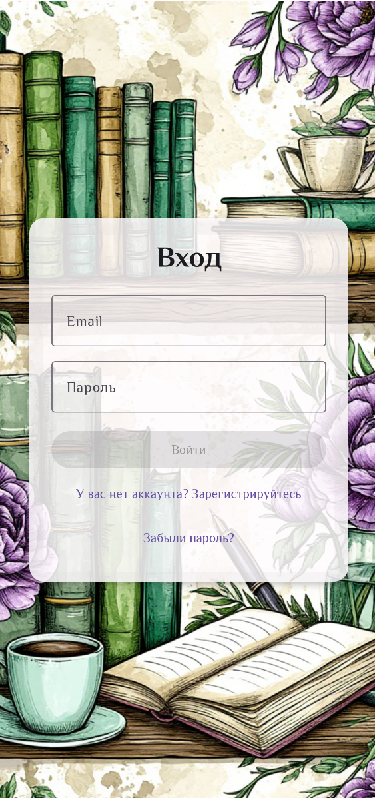
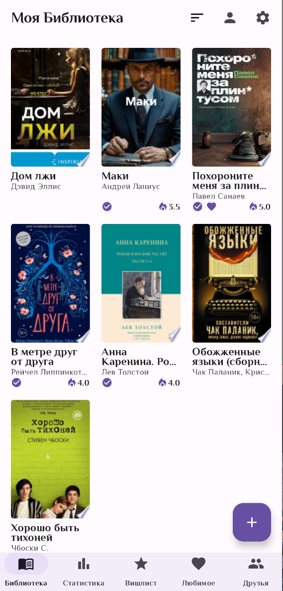
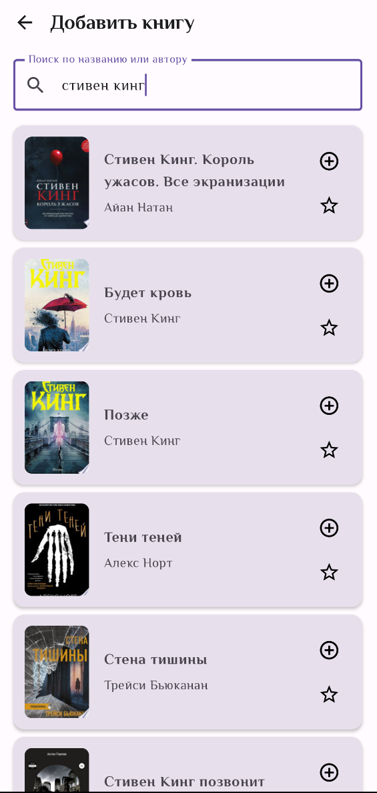
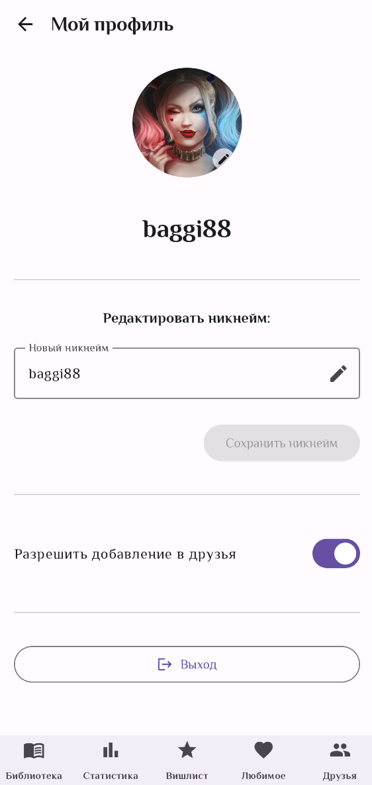
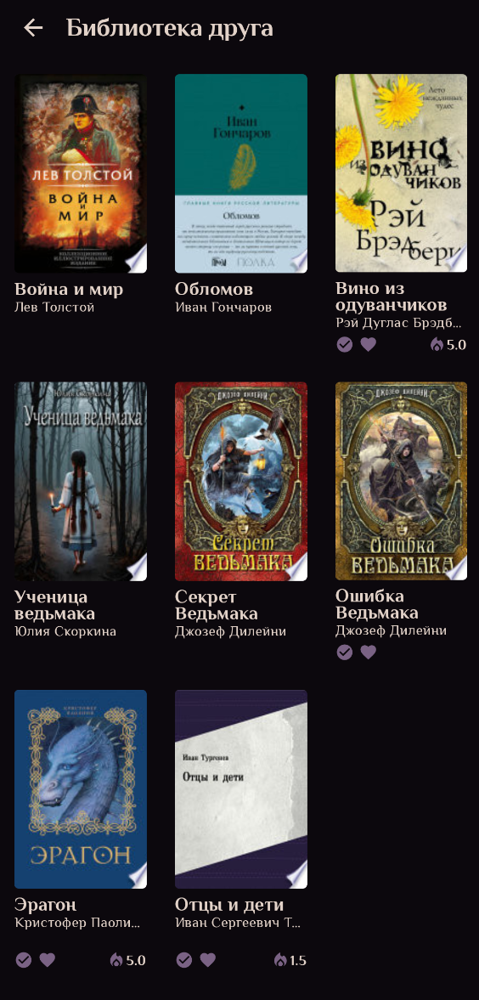
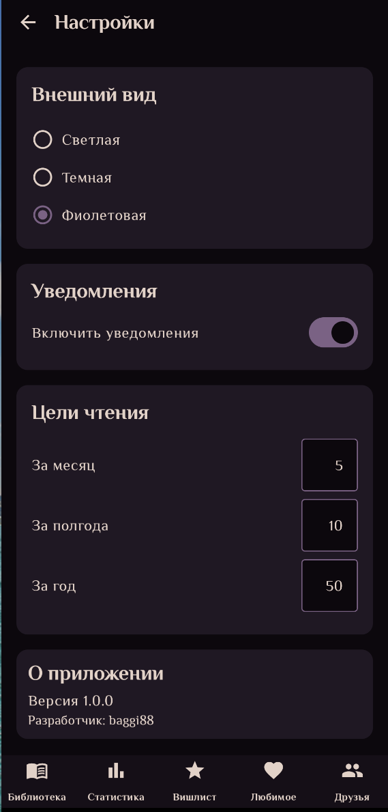
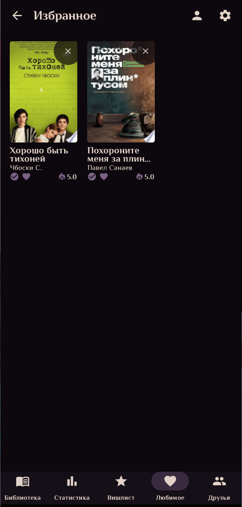

 # Читательская

Приложение для Android, предназначенное для ведения читательского дневника, управления личной библиотекой, поиска новых книг, добавление друзей с возможностью просмотра их библиотеки. Этот проект был создан в качестве моего первого самостоятельного Android-приложения.

## Основные возможности

*   **Поиск книг:** Поиск книг с использованием Google Books API
*   **Личная библиотека:** Добавление книг в личную библиотеку (карточки книг, опции "Прочитано", "Любимое", "Рейтинг", "Вишлист")
*   **Отслеживание прогресса:** Возможность следить за прогрессом чтения: за месяц, полгода, год. Статистика книг в библиотеке, статусы читателя и коллекционера книг, меняются в зависимости от количества.
*   **Информация о книге:** Просмотр детальной информации о книге (описание, автор, обложка и т.д.).
*   **Аутентификация:** Регистрация и вход пользователей с использованием Firebase Authentication
*   **Синхронизация:** Данные библиотеки хранятся в Firebase Firestore и синхронизируются между устройствами.
*   **Социальные функции:** Добавление друзей и просмотр их библиотек
*   **Персонализация:** Настройка цветовой темы приложения

## Стек технологий
*   **Язык:** Kotlin
*   **UI:** Jetpack Compose
*   **Архитектура:** MVVM (ViewModel)
*   **Навигация:** Navigation Compose
*   **Асинхронность:** Kotlin Coroutines & Flow
*   **Внедрение зависимостей:** Hilt
*   **Сеть:** Retrofit (для Google Books API)
*   **База данных:** Firebase Firestore
*   **Аутентификация:** Firebase Authentication
*   **Хранилище настроек:** DataStore Preferences
*   **Загрузка изображений:** Coil
*   **Загрузка/Хранение изображений:** Cloudinary (для аватаров и обложек)

## Скриншоты

<table>
  <tr>
    <td></td>
    <td></td>
    <td></td>
    <td></td>
  </tr>
  <tr>
    <td></td>
    <td></td>
    <td></td>
    <td></td>
  </tr>
   <tr>
    <td></td>
    <td></td>
    <td></td>
    <td></td> <!-- Пустая ячейка для выравнивания -->
  </tr>
</table>