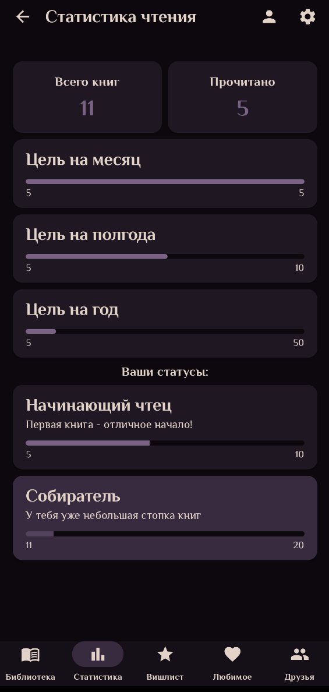

# ReadingRoomL

Приложение для Android, предназначенное для ведения читательского дневника, управления личной библиотекой и поиска новых книг. Этот проект был создан в качестве моего первого самостоятельного Android-приложения.

## Основные возможности

*   **Поиск книг:** Поиск книг с использованием Google Books API.
*   **Личная библиотека:** Добавление книг в личную библиотеку (полки "Читаю", "Прочитано", "Хочу прочитать").
*   **Отслеживание прогресса:** (Уточните, если есть эта функция) Возможность отмечать прогресс чтения.
*   **Информация о книге:** Просмотр детальной информации о книге (описание, автор, обложка и т.д.).
*   **Аутентификация:** Регистрация и вход пользователей с использованием Firebase Authentication.
*   **Синхронизация:** Данные библиотеки хранятся в Firebase Firestore и синхронизируются между устройствами.
*   **Социальные функции:** Добавление друзей и просмотр их библиотек (книжных полок).
*   **Персонализация:** Настройка цветовой темы приложения.
*   **(Добавьте другие функции, если они есть)**

## Стек технологий

*   **Язык:** Kotlin
*   **UI:** Jetpack Compose
*   **Архитектура:** MVVM (ViewModel)
*   **Навигация:** Navigation Compose
*   **Асинхронность:** Kotlin Coroutines & Flow
*   **Внедрение зависимостей:** Hilt
*   **Сеть:** Retrofit (для Google Books API)
*   **База данных:** Firebase Firestore
*   **Аутентификация:** Firebase Authentication
*   **Хранилище настроек:** DataStore Preferences
*   **Загрузка изображений:** Coil
*   **Загрузка/Хранение изображений:** Cloudinary (для аватаров и обложек)
*   **(Добавьте другие библиотеки, если они есть)**

## Скриншоты

---

*Этот README будет дополняться.* 